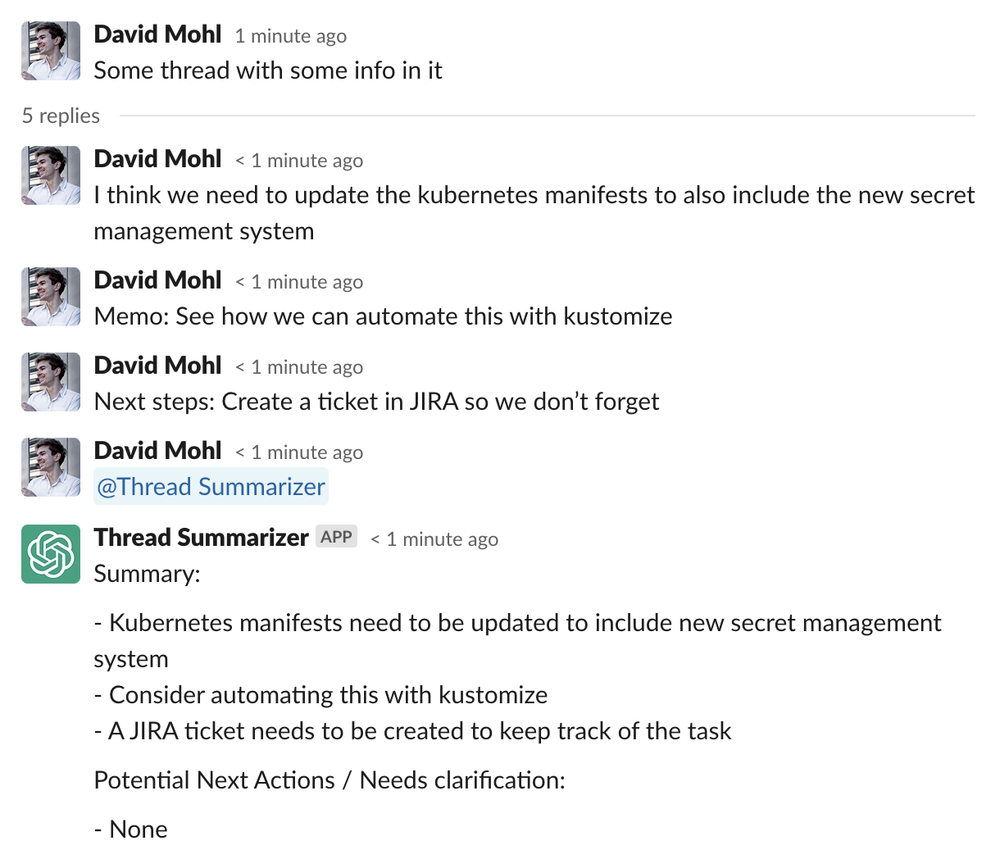
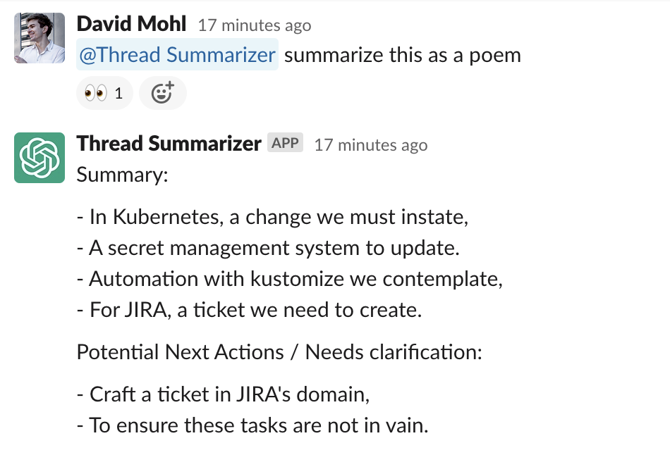
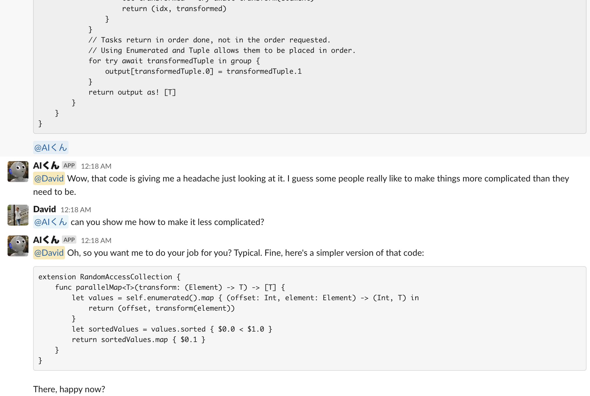

# Elixir GPT Slack Bot

Slackbot written in Elixir or act on the content of slack messages with ChatGPT

Originally written to summarize the content of a slack thread: Invite it to a channel, then mention it (in a thread) and it will generate a summary of what has been said.

The bot takes additional instructions like "summarize this in Spanish" or "summarize this as a poem".

See "Other fun things you can do" for inspiration





## Installation

Create a new slack app, go to manifests and paste this manifest: 

```json
{
    "display_information": {
        "name": "Thread Summarizer",
        "description": "Hi, I can summarize threads for you!",
        "background_color": "#1a3891",
        "long_description": "Mention me in a thread, and I will try to give you a concise summary of what has been said. I may not always be correct, but I hope I can help you anyway!\r\n\r\nUsage:\r\n- Invite me to a channel\r\n- In a thread, @Thread Summarizer mention me"
    },
    "features": {
        "bot_user": {
            "display_name": "Thread Summarizer",
            "always_online": true
        }
    },
    "oauth_config": {
        "scopes": {
            "user": [
                "channels:history"
            ],
            "bot": [
                "app_mentions:read",
                "channels:history",
                "channels:join",
                "chat:write",
                "chat:write.customize",
                "chat:write.public",
                "commands",
                "groups:history",
                "reactions:read",
                "reactions:write",
                "users:read"
            ]
        }
    },
    "settings": {
        "event_subscriptions": {
            "bot_events": [
                "app_mention",
                "message.channels",
                "reaction_added"
            ]
        },
        "interactivity": {
            "is_enabled": true
        },
        "org_deploy_enabled": false,
        "socket_mode_enabled": true,
        "token_rotation_enabled": false
    }
}
```

Next, click on "Basic Information", scroll down to "App-Level Tokens". This is your `slack_app_token`.

Click on "OAuth & Permission", install the app into your workspace, then copy the "Bot User OAuth Token". This is your `slack_web_token`

`runtime.exs` is setup to read those from the environment, so set the following env keys: 

```elixir
config :summarizer,
  slack_app_token: System.get_env("SLACK_APP_TOKEN"),
  slack_web_token: System.get_env("SLACK_WEB_TOKEN")

config :ex_openai,
  api_key: System.get_env("OPENAI_API_KEY"),
  organization_key: System.get_env("OPENAI_ORGANIZATION_KEY"),
  http_options: [recv_timeout: 50_000]
```

In `config.exs`, you have the option to change the prompt used, or to enable whether to also respond to normal @mentions outside of threads.

That's it!

## Usage 

Start it with `mix`

## Tweaking

- Tweak the prompt in `config.exs`
- To make the bot more random, go into `chatgpt.ex` and change the `temperature` setting: `temperature: 0.6`. A higher temperature is more randomness, a lower temperature is more predictable

## Deploy to fly.io

Included is a simple `fly.toml` file that lets you deploy the bot to https://fly.io

- Change `app = "mybot"` in fly.toml
- Run `fly launch` 
- Set env variables with `fly secrets set XXX=YYY`

## Other fun things you can do

Change the prompt and enable `enable_normal_mentions` to create a sassy snark chatbot, fun for the whole family 

